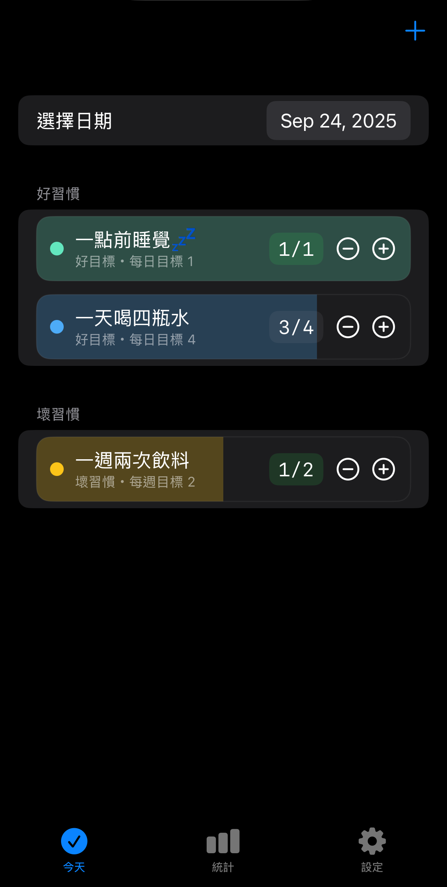
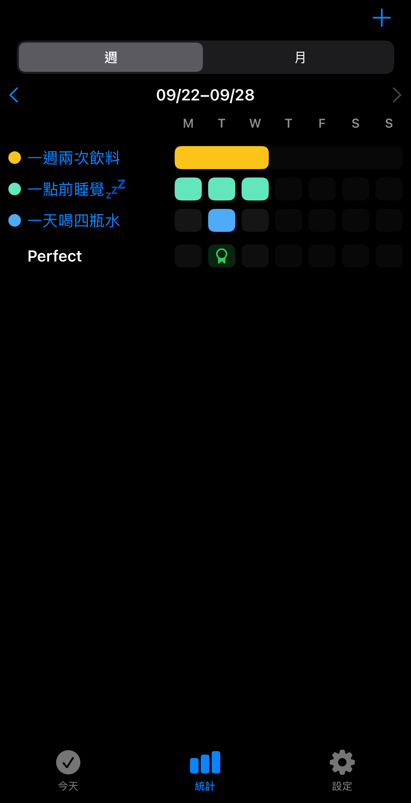
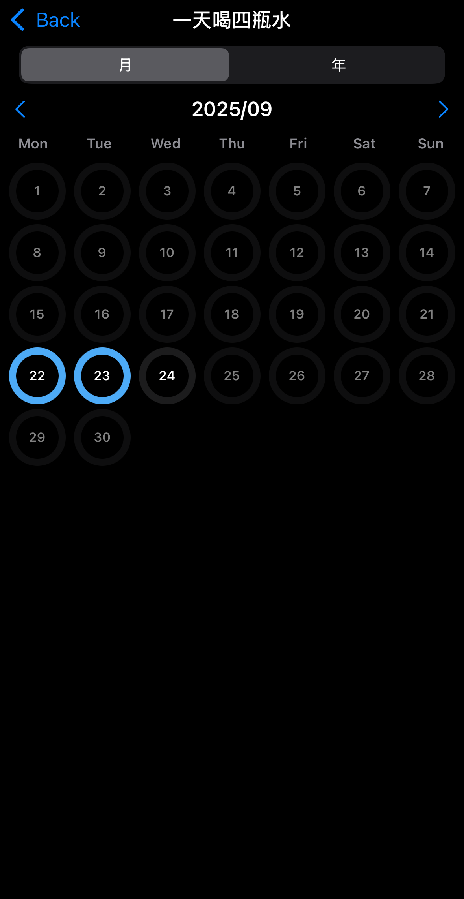

# Habit Diary

A minimal habit tracker for iOS, built with **SwiftUI** and **SwiftData**.  
Track good and bad habits, log progress daily or weekly, and review trends with clear analytics.

---

## Why this?

Many of us want to build habits—like drinking more water, sleeping earlier, or exercising—but often lack a simple tool to keep track of them. **Habit Diary** makes it easy: just add habits, log them each day, and review your progress in the analytics view.

---

## Features

- Good habits (atLeast) and bad habits (atMost) with clear progress feedback  
- Daily / Weekly tracking with flexible start dates  
- Today view with quick +/− logging and filled-color cards  
- Weekly overview, monthly calendar, and per-habit heatmaps  
- Customizable color themes  

---

## Screenshots

  
  
  

---

## Tech Stack

- SwiftUI (UI)  
- SwiftData (local storage)  
- iOS 17+  
- No third-party dependencies  

---

## Getting Started

1. Open in Xcode 15+  
2. Run on an iOS 17+ simulator or device  
3. Create your first habit via the ＋ button on the **Today** tab  
